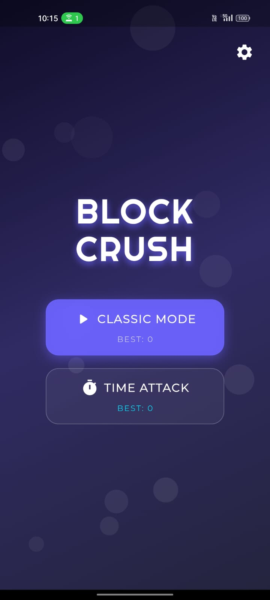
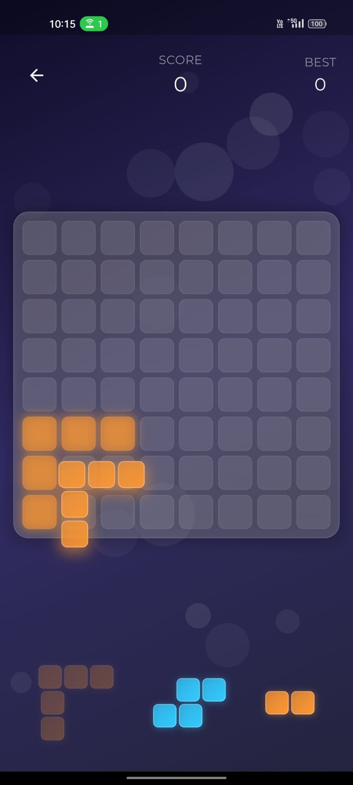

# BlockSlayer

[中文](README.zh.md) · [English](README.en.md) · [Español](README.es.md) · [Inicio del proyecto](README.md)

**INNNX. · Prototipo de Flutter que combina eliminación de bloques y combate contra slimes**

BlockSlayer parte de la planificación del espacio: arrastra piezas de distintas formas al tablero, completa filas o columnas y elimínalas. El prototipo actual añade vida del slime, ataques mediante eliminación de líneas y turnos enemigos contados por colocaciones válidas. Elegir dónde colocar una pieza afecta tanto al espacio disponible como al ritmo del combate.

## Vista de HOME y guía en español

Es la captura auténtica del inicio existente. Conserva BLOCK CRUSH y botones en inglés. No se ha confirmado una interfaz de inicio en chino o español. Esta página explica la interfaz real en español, sin presentar una imagen retocada como una traducción implementada.

| Elemento del inicio | Significado y función |
| --- | --- |
| BLOCK CRUSH | Nombre conservado en la aplicación. La presentación pública usa BlockSlayer; los nombres internos aún no están unificados. |
| CLASSIC MODE | Modo clásico: colocar bloques, eliminar líneas y sumar puntos. Termina cuando ninguna pieza restante cabe en el tablero. |
| TIME ATTACK | Contrarreloj: empieza con 120 segundos en la implementación actual. Cada colocación válida añade 2 segundos y cada línea eliminada, 5 segundos. |
| BEST | Mejor puntuación guardada localmente para el modo correspondiente. |
| Engranaje | Ajustes de efectos de sonido y temas Neon, Wood o Jewel. |

## Mecánica principal: colocar, eliminar y reservar espacio

1. Entra en el modo clásico o contrarreloj.
2. Arrastra una pieza al tablero de 8×8. Debe quedar dentro de sus límites y no solaparse con casillas ocupadas.
3. Completa una fila o columna para eliminarla, sumar puntos y liberar espacio.
4. Cada conjunto ofrece tres piezas. Al usar las tres aparece otro conjunto. Considera las eliminaciones inmediatas y el espacio para formas futuras.
5. El modo clásico termina cuando ninguna pieza restante puede colocarse. El contrarreloj también depende del tiempo disponible.

## Puntuación y tiempo

La implementación actual añade 10 puntos por cada casilla de una pieza colocada correctamente. La bonificación usa “líneas eliminadas × 100 × número de eliminaciones consecutivas”. Colocar sin eliminar reinicia esa racha. En contrarreloj, colocar y eliminar también prolongan el tiempo: hay que decidir rápido y conservar espacio. Estos valores describen la implementación actual y pueden cambiar al ajustar el equilibrio.

## Prototipo de combate contra slimes

El enemigo empieza con 100 puntos de vida. Eliminar una línea causa 10 de daño; dos líneas, 25; tres o más, 45. La respuesta visual conecta las casillas eliminadas con el panel del enemigo: eliminar líneas se convierte en un ataque además de generar puntos.

Por defecto, el enemigo actúa cada cinco colocaciones válidas. Los intentos fallidos no avanzan el contador. Aparece un aviso cuando falta una colocación para el ataque. Al derrotar al slime se detienen sus turnos. La implementación también incluye obstáculos de slime y respuesta visual a sus ataques, por lo que el combate puede afectar a la distribución del tablero.

Estas descripciones proceden de una revisión de solo lectura de la implementación privada. No se han probado ejecutando el juego en esta actualización. La imagen temprana inferior no incluye el panel de combate posterior ni demuestra la validación de la interfaz actual.

## Imagen de juego existente

## Aspecto, sonido y registros locales

El inicio utiliza un fondo degradado, un título luminoso y tarjetas de modos. Los ajustes incluyen temas Neon, Wood y Jewel y un interruptor de efectos de sonido. El almacenamiento local conserva puntuaciones y preferencias relacionadas. Existen dependencias de captura y uso compartido, pero aquí no se ha vuelto a validar el flujo completo de compartir.

## Tecnología, origen y estado

Flutter, Dart, Provider, SharedPreferences, flutter_animate y audioplayers. El material público presenta un prototipo, no una versión terminada y verificada.

El README local original atribuía `block-crush-game` a Md Rounaq Ali. La interfaz y los identificadores conservan Block Crush / block_blast. Esta presentación no atribuye todo el trabajo original a INNNX. Quedan por verificar la URL exacta del proyecto original, la licencia, los permisos de los recursos y el alcance de los cambios. No se adoptan las afirmaciones originales sobre tiendas, rendimiento o licencias.

## Versión jugable y alcance público

Actualmente no hay un instalador público. Antes de ofrecerlo deben comprobarse los permisos de distribución y probarse la instalación, el inicio y la mecánica principal. Este repositorio contiene documentación e imágenes; el código, los materiales de firma y la configuración de desarrollo permanecen privados. El archivo Source code automático de GitHub no es un juego ejecutable.

[Guía de publicación de una versión jugable](docs/PLAYABLE-RELEASE.md)
